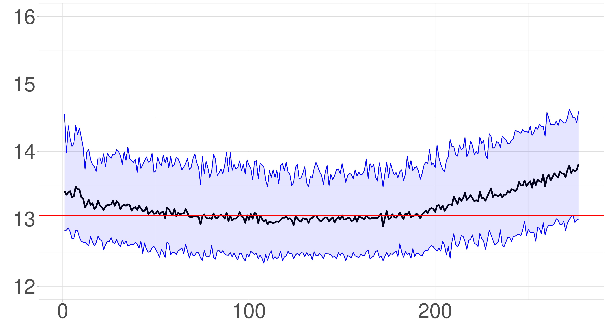

# Approximate Bayesian Computation of reduced-bias extreme risk measures from heavy-tailed distributions

## Abstract

 Most of extrapolation methods dedicated to the estimation of extreme risk measures rely on the approximation of the excesses distribution above a high threshold by a Generalized Pareto Distribution (GPD). We propose an alternative to the GPD, called the Refined Pareto Distribution (RPD), which allows for a second-order approximation of the excesses distribution. The parameters of the RPD are estimated using an Approximate Bayesian Computation (ABC) method, and reduced-bias estimators of extreme risk measures are then derived together with the associated credible intervals. The ABC estimator demonstrates impressive performance over a wide range of heavy-tailed distributions. Its usefulness is also illustrated on two data sets of insurance claims.

## Usage

### Step A: download the 3 R files (Main, FunctionABC and SampleCreation)

### Step B: make sure they are in the same directory

### Step C: open Main.R, install the required packages and follow the instructions

- Step 1: choose the sample size n
- Step 2: choose the number of replications N
- Step 3: choose the level of the quantile pn
- Step 4: choose one of the 7 distributions by initializing the variable ChoixLoi
- Step 5: choose the parameters of the distribution and execute up to line 114

### To reproduce the simulations part

Creation of the estimations:
- Move to line 160 and compute up to line 290 : it corresponds to  the main loop on the number N of replications
- It creates the estimations of the log-quantile which can be saved on lines 301--309

Or load the estimations:
- Move directly to line 317 and load the corresponding matrices of estimations

Then:
- Execute from line 327 to 360 to compute the MSE

#### To reproduce the figures 
- To reproduce the figures of the paper (and the ones of the supplementary material) execute lines 360--400
- With the exception of the figure on the 90\% credible intervals associated with the ABC estimator which have to be computed on the first replication (main loop with N=1)

#### To reproduce the tables
- To reproduce the tables corresponding to the MRMSE1 given in the supplementary material execute lines 406--409
- To reproduce the tables corresponding to the MRMSE2 given in the paper execute lines 410--465

### To reproduce the real data set part

- Step 6: choose and load the real data set :  Besecura or Flood

Besecura correspond to the Secura Belgian automobile claims data set (lines 121--126)  
Flood correspond to the OpenFEMA flood claims data set (lines 130--134)

- Step 6 bis: be vigilant on the level of the quantile to compare with

If you are interested in log-quantile estimation pn=1/n  
If you are interested in log-Expected Shortfall  estimation pn=0.5\%

- Then execute up to line 290 (main loop with N=1)

Move to line 470 to reproduce the figures of the paper for the Besecura case    
Move to line 550 to reproduce the figures for the OpenFEMA case  

#### The current code is designed to reproduce the OpenFEMA case with pn=0.5\% as illustrated by the figure below

**Reference:** J. El Methni & S. Girard, "Approximate Bayesian Computation of reduced-bias extreme risk measures from heavy-tailed distributions", https://hal.inria.fr/hal-04965629

<i>Estimation of the log-Expected Shortfall (with associated 90% credible intervals) on the OpenFEMA data set.</i>

